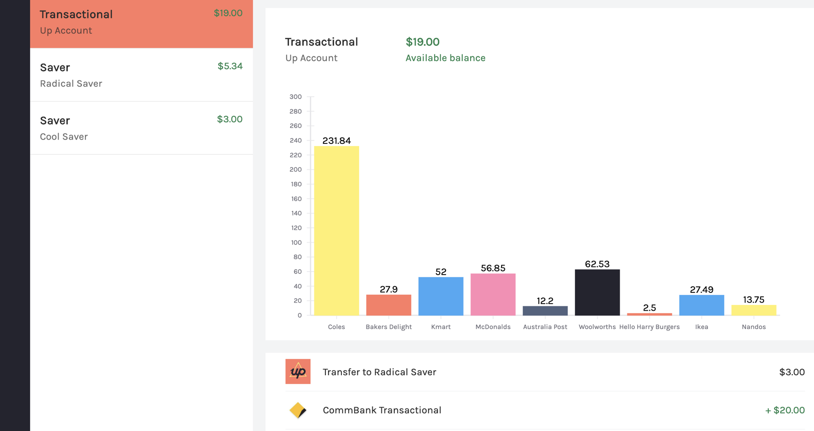

# [up-api-web-example](https://github.com/svnm/up-api-web-example)

Example web client using Up Api https://api.up.com.au



## Getting Started

Go to [Up API getting started](https://developer.up.com.au/#getting-started) to get your access token.

Rename `next.config.example.js` to `next.config.js` and replace <UP API TOKEN> with your token

Install dependencies:

```bash
yarn
```

Run the development server:

```bash
yarn dev
```

Run stories for components:

```bash
yarn storybook
```

To update your merchants with ones you commonly use edit `next.config.example.js`
You can also add merchant logos to `/public/merchants` and return them from `api/merchants`

Open [http://localhost:3000](http://localhost:3000) with your browser to see the result.

## Tech used

- [Next.js](https://nextjs.org) △
- [Styled-jsx](https://github.com/vercel/styled-jsx) 👩‍🎤
- [Up API](https://developer.up.com.au) ⚡️
- [Storybook](https://storybook.js.org) 🖼
- [TypeScript](https://www.typescriptlang.org) ✨
